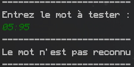

## Contexte

Ce projet a été réalisé par Mathieu BERGERON dans le cadre d'un projet informatique pour l'IUT de Nantes. Le projet consistait à concevoir et implémenter un analyseur/accepteur de mot grâce à un automate déterministe. Le travail a été réalisé en Février 2023.

## Introduction
Les automates sont des modèles mathématiques qui permettent de décrire le comportement de systèmes complexes. Ils ont de nombreuses applications en informatique, notamment dans la conception de logiciels, la vérification de programmes, la reconnaissance de langages et la modélisation de processus.

## Réalisation
Dans le cadre de ce projet, j'ai implémenté un analyseur/accepteur de mot en utilisant le langage de programmation Kotlin. 
L'implémentation est basée sur la définition formelle des automates déterministes, avec des classes pour les états et les automates.
La classe <b>Automata</b> possède ainsi une méthode permettant de dire si un mot est reconnu ou non par son automate.  
Il est possible d'importer des automates, sous forme de json dans le dossier **automates**, et aussi de les exporter sous forme de graphes, dans le dossier **exports**.

J'ai testé mon implémentation avec plusieurs exemples d'automates, par exemple un automate qui permet de vérifier un horaire, ou encore un automate qui peut vérifier si un nombre est un multiple de 3.

  
*Une horaire valide*  

  
*Une horaire invalide*  

  
*Un multiple de 3*

L'architecture du projet est simple, il y a une classe **Automata** et une classe **State**, qui permettent le fonctionnement du projet.   
De plus, il y a une classe **AutomataSerializable** et une classe **StateSerializable**, qui permettent de faire la transition entre les fichiers json et leur classe respective.  
Pour finir, il y a le fichier **main.kt**, qui se lance au démarrage et qui gère toute la partie interaction utilisateur.

## Utilisation simple
Pour utiliser le programme, il suffit d'exécuter l'exécutable qui se trouve dans le dossier, et de suivre ce qui est écrit. En général, il faut utiliser la commande suivante dans un terminal    
```bash
java -jar automate.jar
```

Il est aussi possible d'ouvrir le projet depuis IntelliJ pour l'exécuter.  
Il est tout à fait possible de rajouter ses propres automates, il suffit pour cela de créer ses propres fichiers en suivant la syntaxe des automates déjà présents, et de les placer dans le dossier <b>automates</b>.
## Utilisation comme API :
Mon projet peut être utilisé comme une API pour des applications qui ont besoin de vérifier si une chaîne de caractères appartient ou non à un langage régulier décrit par un automate fini. En utilisant ma bibliothèque, les développeurs peuvent facilement intégrer cette fonctionnalité dans leurs applications en invoquant simplement notre méthode d'analyse avec la chaîne de caractères en entrée.

## Limitations :
Mon implémentation d'automates finis déterministes ne prend pas en charge les automates non déterministes.

## Conclusion :
Dans l'ensemble, le projet fournit une solution simple et pratique pour la vérification de chaînes de caractères en fonction d'un langage régulier défini par un automate fini déterministe. J'espère que la bibliothèque pourra être utile aux développeurs qui cherchent à intégrer cette fonctionnalité dans leurs applications. De plus, mon travail pourrait être étendu pour inclure la prise en charge d'automates non déterministes.